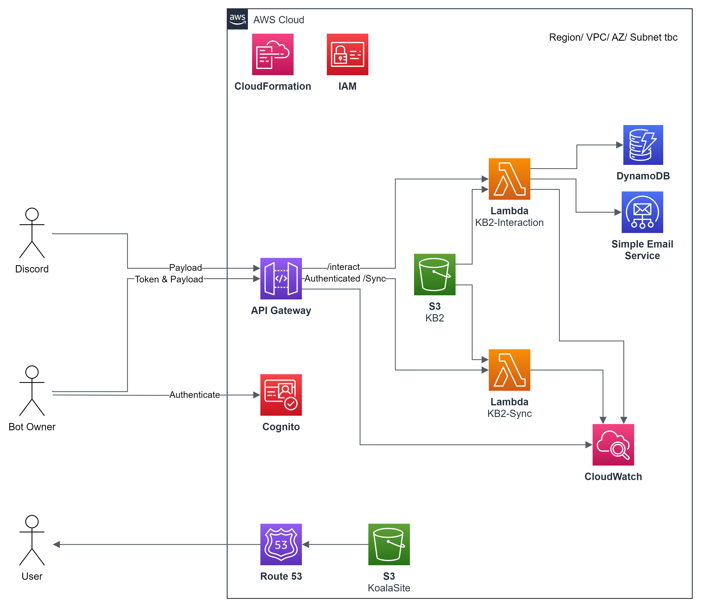

# KB2
[](https://discord.gg/5etEjVd)
[](https://github.com/KoalaBotUK/KB2/actions/workflows/serverless-package.yml)

A serverless optimized interaction based Discord bot. 
This is an all-in-one bot with multiple functions custom-built for university clubs and societies.

This bot is the new generation of the original [KoalaBot](https://koalabot.uk) project. This project is an open source discord bot with a development 
team of students and alumni from around UK and Europe.


## Cloud Architecture


## Infrastructure as Code
CloudFormation will be used to spin up the AWS services defined in the [Cloud Architecture](#cloud-architecture)


## Getting Started
These instructions will get you a copy of the project up and running on your local machine for development and testing purposes. See deployment for notes on how to deploy the project on a live system.

## Prerequisites
This application uses python 3.11 which you can download [here](https://www.python.org/downloads/)

All python packages you need to run on serverless can be found in the [requirements.txt](requirements.txt).
Before running the bot you must install these as so:

```bash
$ pip3 install -r requirements.txt
``` 

If you would like to run a server version locally, you will also need to install Flask
```bash
$ pip3 install flask
```

### Environment Variables
This project does not provide `.env` support by default to reduce package size for serverless. 
You will instead have to provide the environment variables either as part of serverless deployment, or at runtime if running the server.

The environment variables required are listed below:

`PUBLIC_KEY` : The public key from the application in the Discord developers portal<br>
`BOT_TOKEN` : The secret token from the bot in the Discord developers portal

### Running KB2
You can use the [Infrastructure as Code](#Infrastructure-as-Code) to spin up your serverless environment.

If you are using a server the following can be used:
```bash
$ python3 ./kb2/main.py
```

## License
This project is licensed under the MIT License - see the [LICENSE](LICENSE) file for details


## Links
* KoalaBot Website: [koalabot.uk](https://koalabot.uk)
* KoalaBot Support Discord: [discord.koalabot.uk](https://discord.koalabot.uk)
