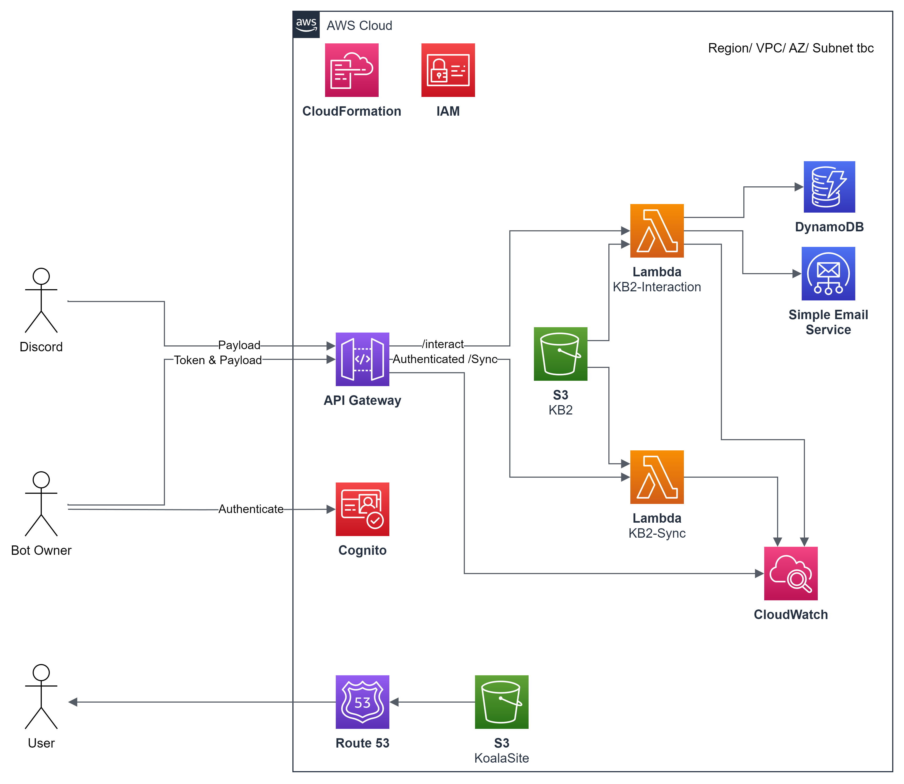

# KB2
[](https://discord.gg/5etEjVd)
[](https://github.com/KoalaBotUK/KB2/actions/workflows/serverless-package.yml)

A serverless optimized interaction based Discord bot. 
This is an all-in-one bot with multiple functions custom-built for university clubs and societies.

This bot is the new generation of the original [KoalaBot](https://koalabot.uk) project. This project is an open source discord bot with a development 
team of students and alumni from around UK and Europe.

## Features
- Verify
- ColourRole
- TwitchAlert

### Possible Removal
- Announce - Too intensive on Rate Limit
- Vote - Maybe replaced by Polls

### Removed since Legacy KoalaBot
- ReactForRole - Replaced by Discord Onboarding 
- TextFilter - Replaced by Discord AutoMod

## Cloud Architecture


## Infrastructure as Code
CloudFormation will be used to spin up the AWS services defined in the [Cloud Architecture](#cloud-architecture)


## Getting Started
These instructions will get you a copy of the project up and running on your local machine for development and testing purposes. See deployment for notes on how to deploy the project on a live system.

## Prerequisites
The `api`, `gateway`, `consumer` and `common` crates are a Rust workspace built and deployed with
[`cargo lambda`](https://www.cargo-lambda.info/). Install the Rust toolchain [here](https://www.rust-lang.org/tools/install)
and then install `cargo lambda` following its [installation guide](https://www.cargo-lambda.info/guide/installation.html).

The `ui` directory is a Vue3/TypeScript frontend that requires [Node.js](https://nodejs.org/) (v22+). Install its
dependencies with:

```bash
$ cd ui
$ npm install
```

### Environment Variables
This project does not provide `.env` support by default to reduce package size for serverless.
You will instead have to provide the environment variables either as part of serverless deployment, or at runtime if running locally.

The environment variables required by the `api`/`consumer`/`gateway` crates are listed below:

`DSQL_USER` : The username used to connect to the Aurora DSQL database<br>
`DSQL_ENDPOINT` : The endpoint hostname of the Aurora DSQL database<br>
`DISCORD_BOT_TOKEN` : The secret token from the bot in the Discord developers portal<br>
`DISCORD_PUBLIC_KEY` : The public key from the application in the Discord developers portal<br>
`DEPLOYMENT_ENV` : The deployment environment name (e.g. `dev` or `prod`)<br>
`SQS_URL` : The URL of the SQS queue used for audit events

The `ui` app additionally requires the following build-time variables:

`VITE_KB_API_URL` : The base URL of the deployed `api`<br>
`VITE_DISCORD_CLIENT_ID` : The Discord OAuth2 client ID<br>
`VITE_GOOGLE_CLIENT_ID` : The Google OAuth2 client ID<br>
`VITE_MICROSOFT_CLIENT_ID` : The Microsoft OAuth2 client ID

### Running KB2
You can use the [Infrastructure as Code](#Infrastructure-as-Code) to spin up your serverless environment.

To build the Rust crates locally:
```bash
$ cargo lambda build --release --output-format zip -p api -p consumer
```

To run the `ui` app locally:
```bash
$ cd ui
$ npm run dev
```

## License
This project is licensed under the MIT License - see the [LICENSE](LICENSE) file for details


## Links
* KoalaBot Website: [koalabot.uk](https://koalabot.uk)
* KoalaBot Support Discord: [discord.koalabot.uk](https://discord.koalabot.uk)
