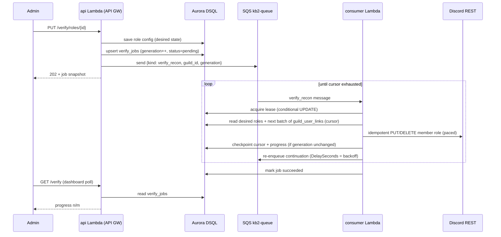

# Verify Role Reconciliation Architecture

Status: **Proposed** · Scope: `api`, `consumer`, `common`, `infra`, `ui` · Design target: guilds with up to **50,000 linked members**

## 1. Problem

Adding, removing, or reconciling a verify role today performs the entire Discord role
fan-out **synchronously inside a single API request**:

- `PUT /guilds/{guild_id}/verify/roles/{role_id}` (`api/src/guilds/verify/controllers.rs`)
  loads the whole guild JSON blob (including the full `verify.user_links` map), then loops
  over every linked user issuing one Discord REST call per matching user before saving and
  responding. `DELETE` and `POST /recon` follow the same pattern; recon is O(users × roles)
  Discord calls.

This breaks on large servers:

| Issue | Effect at scale |
|---|---|
| API Gateway 29 s hard timeout | Discord's per-guild role-modify bucket allows roughly 5–10 req/s, so ~250 members is the practical ceiling for one request. A 50k-member guild needs **hours** of wall time. |
| `guild.save()` only after the loop | A timeout mid-loop applies roles in Discord but never persists the role config. No checkpoint, no resume. |
| `retry_on_rl` sleeps in-process | Lambda GB-seconds are billed while sleeping through 429s, burning toward the timeout while doing zero work. |
| Guild stored as one JSON blob (read-modify-write) | Concurrent handlers (admin edits a role while a user links) silently clobber each other's writes. Every request's memory and I/O scale with guild size. |

## 2. Decisions

These were agreed during design review:

1. **Scale target:** 50k linked members per guild.
2. **UX model:** role changes return `202 Accepted` immediately; roles propagate
   asynchronously with a progress indicator in the dashboard.
3. **Orchestration:** SQS self-requeue on the existing standard queue, processed by the
   existing `consumer` crate (no new queue, no Step Functions).
4. **Serialization & backoff:** a `verify_jobs` DB row acts as per-guild lease, cursor
   checkpoint, and progress record; per-message `DelaySeconds` handles 429 backoff.
5. **Concurrent config changes supersede:** one active job per guild with a `generation`
   counter; a config change during a running job bumps the generation and the worker
   restarts its cursor at the next checkpoint.
6. **Drift repair stays manual:** the recon endpoint/button remains the only drift-repair
   trigger (now enqueueing a job). No scheduled or gateway-event-driven repair — truest
   scale-to-zero.
7. **Data model:** `verify.user_links` is normalized out of the guild JSON blob into its
   own table so the reconciler can paginate with a cursor and link operations become
   single-row writes.

## 3. Target architecture



The API layer stops *doing* the work and instead **persists desired state and enqueues a
reconciliation job**. A single unified reconciler replaces the three hand-rolled loops in
`put_roles_id`, `delete_roles_id`, and `post_recon`.

### 3.1 Data model

New tables (Aurora DSQL, following existing migration conventions):

```sql
-- Normalized replacement for guilds.verify.user_links
CREATE TABLE IF NOT EXISTS guild_user_links(
    guild_id NUMERIC(20, 0) NOT NULL,   -- u64
    user_id  NUMERIC(20, 0) NOT NULL,   -- u64
    links    TEXT NOT NULL,             -- JSON Vec<Link>, same shape as users.links
    created_at TIMESTAMP NOT NULL DEFAULT CURRENT_TIMESTAMP,
    updated_at TIMESTAMP NOT NULL DEFAULT CURRENT_TIMESTAMP,
    PRIMARY KEY (guild_id, user_id)
);

-- One row per guild: lease + cursor + progress. PK = guild_id enforces the
-- single-active-job invariant by construction.
CREATE TABLE IF NOT EXISTS verify_jobs(
    guild_id    NUMERIC(20, 0) NOT NULL PRIMARY KEY,
    generation  BIGINT NOT NULL DEFAULT 0,
    status      TEXT NOT NULL,           -- pending | running | succeeded | failed
    scope       TEXT,                    -- JSON: {"all"} or {"role_add": id} etc.
    cursor      NUMERIC(20, 0),          -- last processed user_id (keyset pagination)
    total       INTEGER NOT NULL DEFAULT 0,
    processed   INTEGER NOT NULL DEFAULT 0,
    errors      INTEGER NOT NULL DEFAULT 0,
    lease_until TIMESTAMP,
    created_at  TIMESTAMP NOT NULL DEFAULT CURRENT_TIMESTAMP,
    updated_at  TIMESTAMP NOT NULL DEFAULT CURRENT_TIMESTAMP
);
```

`guilds.verify` keeps the (small) `roles` array — role config is desired state and stays
cheap to read/write. Only the per-member map moves out. Role `members` counts become a
`COUNT`-style aggregate the worker maintains during reconciliation (or a cheap
`SELECT count(*)` over `guild_user_links` filtered in-process by pattern), removing
`recompute_role_members()`'s dependence on having every link in memory.

Keyset pagination (`WHERE guild_id = $1 AND user_id > $cursor ORDER BY user_id LIMIT $n`)
gives the worker O(batch) reads regardless of guild size, and link/unlink handlers become
single-row upserts/deletes — eliminating the blob read-modify-write race.

### 3.2 Message contract

Reuses the existing standard queue (`kb2-queue-{env}`) and the `consumer` crate's
`kind` message-attribute dispatch, alongside `audit`:

```json
// message attribute: kind = "verify_recon"
{ "guild_id": "590643624358969350", "generation": 7 }
```

The message is deliberately minimal — the `verify_jobs` row is the source of truth for
scope, cursor, and progress. Duplicate or stale deliveries are harmless (see 3.4).

### 3.3 Worker algorithm (consumer crate)

```
on verify_recon(guild_id, generation):
  job ← SELECT * FROM verify_jobs WHERE guild_id = $1
  if job is missing, or generation < job.generation, or job.status is terminal:
      return Ok            // stale message; the newer chain owns the work
  acquire lease:
      UPDATE verify_jobs SET lease_until = now() + LEASE, status = 'running'
      WHERE guild_id = $1 AND generation = $2
        AND (lease_until IS NULL OR lease_until < now())
      → 0 rows updated ⇒ another invocation holds the lease ⇒ return Ok

  roles ← guild config (desired state)
  deadline ← now() + WORK_BUDGET          // e.g. 60 s, well under Lambda timeout
  loop while now() < deadline:
      batch ← next LIMIT-N rows of guild_user_links after job.cursor
      if batch is empty: mark job succeeded; return Ok
      for each (user_id, links) in batch:
          desired ← roles matched by link_arr_match(links, role.pattern)
          issue idempotent PUT/DELETE per role in scope   // paced ≤ RATE req/s
          on 429 with retry_after ≤ SHORT_WAIT: sleep briefly (bounded budget)
          on 429 with retry_after >  SHORT_WAIT: backoff ← retry_after; break
          on 403/404: count as error/skip; never fail the job
      checkpoint:
          UPDATE verify_jobs SET cursor=$c, processed=+n, errors=+e
          WHERE guild_id=$1 AND generation=$2
          → 0 rows ⇒ superseded mid-flight ⇒ return Ok (new chain restarts)
  send continuation message (DelaySeconds = backoff, else 0); release lease; return Ok
```

Properties:

- **No long sleeps in compute.** Sub-second 429s are absorbed inline (cheap); anything
  longer becomes `DelaySeconds` on the continuation message — the wait costs nothing.
- **Crash-safe.** The continuation is only sent after a successful checkpoint. If the
  invocation dies before that, the handler errors, SQS redelivers the *original* message
  after the visibility timeout, and the lease expiry lets the retry pick up from the last
  checkpoint. At-least-once delivery + idempotent Discord calls + conditional checkpoints
  ⇒ safe under every interleaving.
- **Supersede semantics.** API handlers that change verify state do
  `UPDATE verify_jobs SET generation = generation + 1, cursor = NULL, scope = merged, status = 'pending'`
  (inserting the row if absent) and enqueue a message with the new generation. The running
  worker's next conditional checkpoint matches 0 rows and exits; the new message chain
  restarts from a null cursor against the latest desired state. One chain per guild,
  always converging on the newest config.
- **Scoped jobs stay cheap.** A single role add reconciles only that role (scope
  `role_add`), issuing calls only for users whose links match the pattern — non-matching
  rows cost one in-process regex check, no Discord call. Full recon (scope `all`) may
  optionally fetch the member once (`GET /guilds/{id}/members/{uid}`, a separate rate
  bucket) and diff desired vs actual roles, issuing only deltas — on a healthy guild this
  collapses M writes per user into 1 read.

### 3.4 API changes

| Endpoint | Before | After |
|---|---|---|
| `PUT /verify/roles/{id}` | inline fan-out, 200 with role | validate pattern → save role config → bump job generation → enqueue → **202** with role + job snapshot |
| `DELETE /verify/roles/{id}` | inline fan-out, 204 | remove role from config → bump generation (scope `role_remove`, pattern captured in scope so the worker knows what to strip) → enqueue → **202** |
| `POST /verify/recon` | inline O(users×roles) loop | bump generation (scope `all`) → enqueue → **202** |
| `PUT/DELETE /users/{id}/link/guilds/{gid}` | inline per-role calls for one user | unchanged behaviour — a **single user** is at most a handful of calls, so it stays synchronous; writes go to `guild_user_links` instead of the blob |
| *(new)* `GET /guilds/{id}/verify/job` | — | returns the `verify_jobs` row (status, processed/total, errors) for dashboard polling |

Single-user link operations deliberately stay synchronous: the architecture problem is the
per-guild fan-out, not the per-user path, and instant feedback on "I just verified" is the
product's core loop.

### 3.5 UI changes

`VerifyComponent` polls `GET /verify/job` while a job is non-terminal and renders a
progress bar ("Syncing roles… 12,400 / 50,000") plus an error count. Role add/remove
buttons stay enabled (supersede handles overlap); the recon button is disabled only while
a scope-`all` job is running to avoid pointless duplicate full scans.

## 4. Throughput & cost at the design target

Discord's per-guild role-modify bucket (~5–10 req/s) is the hard physical bottleneck; no
architecture can beat it, so the goal is to *ride* it at near-zero cost:

- **Wall time:** 50k matching members ≈ 1.5–3 h for a scoped role add. This runs as
  ~100–180 chained one-minute consumer invocations.
- **Lambda:** ~2 h × 128 MB ≈ 900 GB-s ≈ **$0.015** per full 50k job (invocation count
  negligible).
- **SQS:** a few hundred messages ≈ **$0.0001**.
- **Idle cost:** zero. No new always-on components; the queue, consumer, and tables all
  scale to zero. Small guilds (< batch size) complete in a single consumer invocation
  seconds after the 202.

## 5. Rollout plan

1. **Migration 1:** create `guild_user_links` + `verify_jobs`; backfill
   `guild_user_links` from existing `guilds.verify.user_links` JSON.
2. **Code:** switch link/unlink/recon/role handlers to the new table (dual-write to the
   blob during the transition if a staged deploy is needed); add the `verify_recon`
   consumer kind; convert the three fan-out endpoints to enqueue; add the job endpoint.
3. **UI:** progress polling + 202 handling.
4. **Migration 2 (cleanup):** stop writing `user_links` into `guilds.verify`; strip the
   field from stored blobs opportunistically on save.

## 6. Alternatives considered

- **Step Functions Standard** — free `Wait` states and managed per-job history are
  attractive (~$0.004 per 50k job), but it adds a new service, IAM surface, and Terraform
  module for a loop the existing consumer + a jobs row expresses adequately. Rejected in
  favour of reusing infra already operated for audit.
- **FIFO queue with `MessageGroupId = guild_id`** — free serialization, but FIFO does not
  support per-message `DelaySeconds`, forcing 429 backoff into in-Lambda sleeps or
  `ChangeMessageVisibility` gymnastics, and it's a second queue to operate. The DB lease
  is needed for progress tracking anyway.
- **Gateway-event-driven drift repair** (member leave / role delete events) — most
  correct, but reintroduces the persistent gateway consumption KB2's interaction-based
  design deliberately avoids. Manual recon covers drift acceptably.
- **Hybrid sync-below-threshold** — doing small guilds inline avoids the 202 for the
  common case but creates two code paths for the same operation; instead, small guilds
  simply see the async job complete within seconds.
